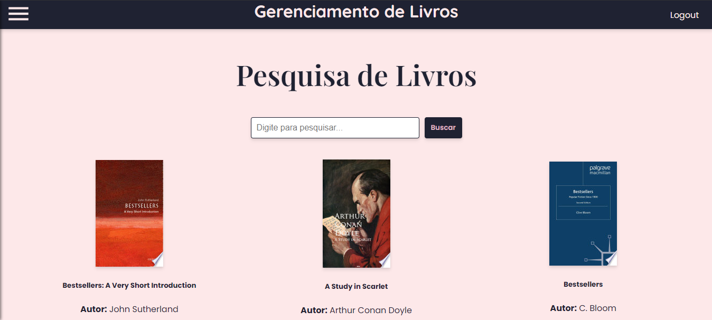
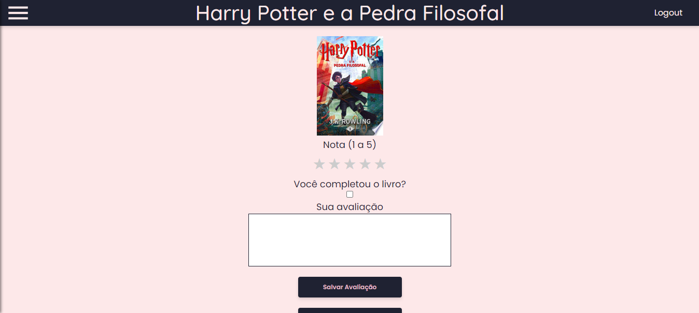
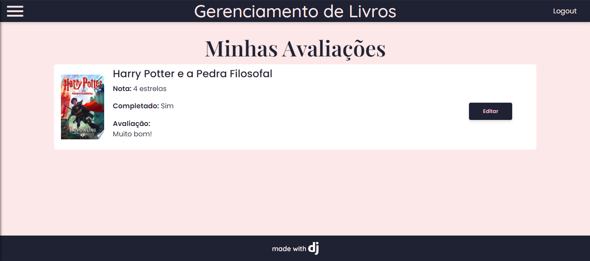
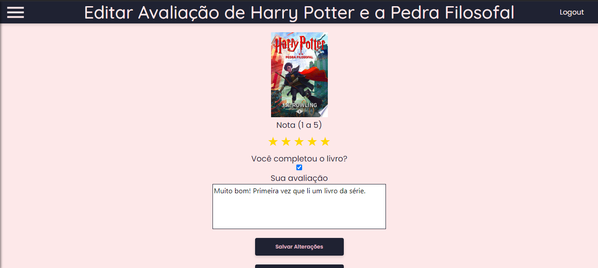
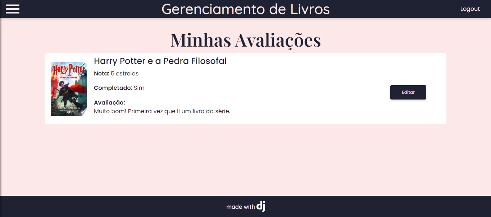
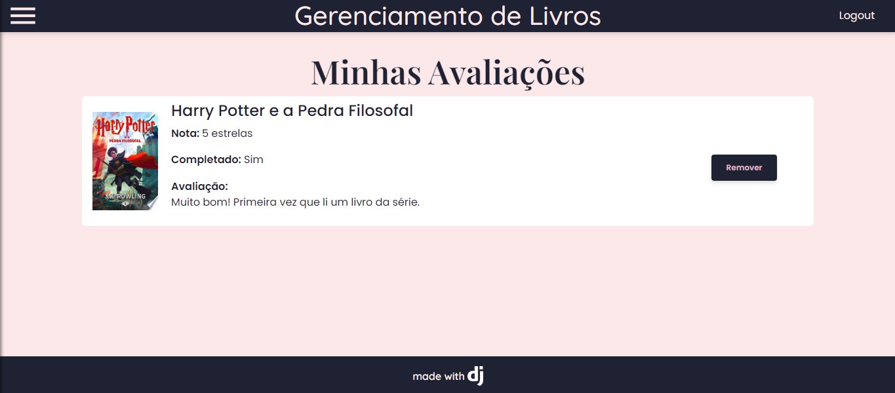
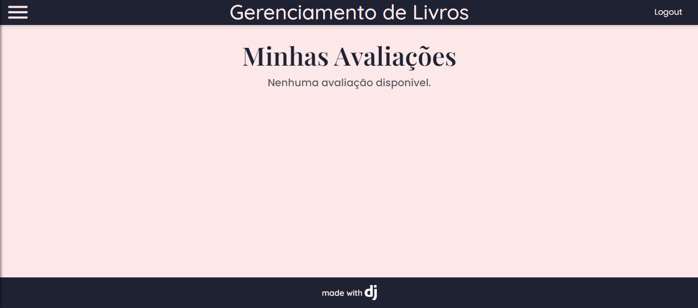

# Projeto_CRUD_DW3

## Gerenciador de Livros e Avaliações

### Descrição

Esta aplicação web foi desenvolvida com o intuito de ser apresentada como entrega para o projeto final da disciplina: Desenvolvimento Web III.

O gerenciador de Livros (e também avaliações) tem a capacidade de fazer pesquisa de livros pelo nome, adicionar avaliações de livros, remover avaliações já feitas e também editar qualquer avaliação que já tenha sido feita pelo usuário.

Professor Aplicante: Orlando Saraiva Jr.

#### Tecnologias usadas

<ul>
  <li>Python3: https://www.python.org/</li>
  <li>Django: https://www.djangoproject.com/</li>
  <li>SQLite: https://www.sqlite.org/</li>
  <li>Google Books API: https://developers.google.com/books?hl=pt-br</li>
</ul>

### Funcionalidades

#### Catalogo de Livros com Pesquisa



<ul>
  <li>Digite qualquer livro de sua escolha na barra de pesquisas e encontre na lista de livros disponivel na pagina.</li>
  <li>Todos os dados dos livros exibidos são armazenados no banco de dados SQLite integrado do Django.</li>
  <li>obs: alguns livros podem não estar disponiveis para busca no momento.</li>
</ul>


<ul>
  <li>Ao clicar no livro de sua escolha que está presente na lista, você será direcionado para uma pagina com alguns detalhes do livro como nome do(a) autor(a) e descrição do livro.</li>
  <li>Nessa pagina também estão presentes dois botões: um para adicionar uma avaliação sobre o livro e outro para voltar para o catalogo.</li>
</ul>

#### Criação de Avaliação sobre o livro / CREATE



<ul>
  <li><strong>Nessa pagina você pode preencher um formulario para criar uma avaliação do livro escolhido anteriormente.</strong></li>
  <li>o nivel de nota do livro é representado como estrelas: 1 a 5 estrelas.</li>
  <li>você pode mostrar se você já terminou esse livro ou não.</li>
  <li>E não menos importante, pode escrever uma avaliação detalhada sobre o que você achou do livro!</li>
  <li>Também existem 2 botões nessa pagina, um para <strong> salvar a avaliação </strong> e outro para <strong> voltar aos detalhes do livro.</strong></li>
</ul>

#### Lista de Avaliações / READ



<ul>
  <li>Nessa pagina, o usuario pode ver uma lista de todas as avaliações que foram feitas por ele.</li>
  <li>em cada avaliação da lista, existe o botão editar que ao apertar o usuario poderá editar a avaliação feita para o livro.</li>
  <li><strong>Cada livro só pode ter uma avaliação na lista.</strong></li>
</ul>

#### Edição de Avaliações / UPDATE



<p>Não tem nada de diferente nessa página, ela é similar a página de criação de avaliação. Mas a principal diferença é que você está editando uma avaliação já feita.</p>



#### Remoção de Avaliações / DELETE



<ul>
  <li>Uma página que não é muito diferente da página de listar avaliações.</li>
  <li>Cada avaliação na lista tem um botão para remove-la da lista.</li>
</ul>



### Requisitos
<ul>
  <li>Python 3.x instalado</li>
  <li>Todas as dependencias do arquivo "requirements.txt" instaladas</li>
</ul>

### Como usar?

#### Clone o repositório em uma pasta a parte, instale e crie um ambiente virtual
<ul>
  <li>Abra um terminal ou prompt de comando.</li>
  <li>Instale o "VirtualEnv" do python com o seguinte comando:</li>
  <br>
  
  ```
  pip install virtualenv
  ```
  <li>Navegue até o diretório "CRUD" do projeto e siga os seguintes passos:</li>
  <br>
  <p>No Windows</p>
  
  ```
  - python -m virtualenv venv
  - cd venv
  - cd Scripts
  - activate.bat
  ```

  <br>
  <p>No Linux</p>
  
  ```
  - virtualenv -p python3 venv
  - cd venv
  - cd bin
  - source activate
  ```

<li>Volte até a pasta onde o arquivo "requirements.txt" está presente e instale as dependencias com o comando:</li>
  <br>

  ```
  pip install -r requirements.txt
  ```

<li>Por último, vá para a pasta "CRUD" do projeto e execute os seguintes passos para executar a aplicação:</li>
<br>

```
  - python manage.py makemigrations
  - python manage.py migrate
  - python manage.py runserver
  ```

 ## Por enquanto é só! 
  ### Muito Obrigado por ler até aqui.


